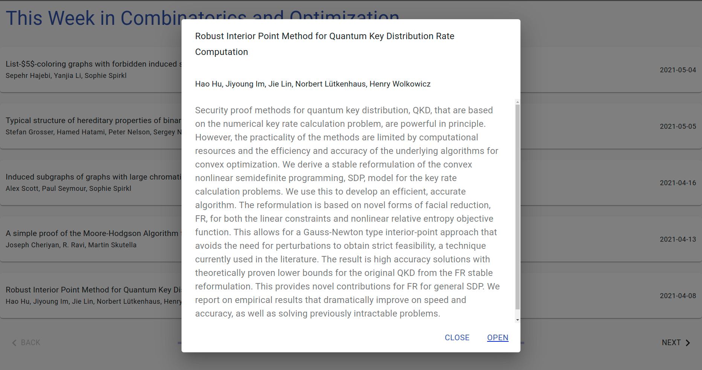

### This Week in Combinatorics and Optimization

This Week in Combinatorics and Optimization is a web app that updates weekly with any new papers on the arXiv by Waterloo C&O faculty. It sorts papers from the last 2 years.

It uses the arXiv API to source papers, a node.js cron-worker to update a Redis store with the papers bi-weekly, and an Express server to serve a static React + Material UI frontend and single API route.

 

